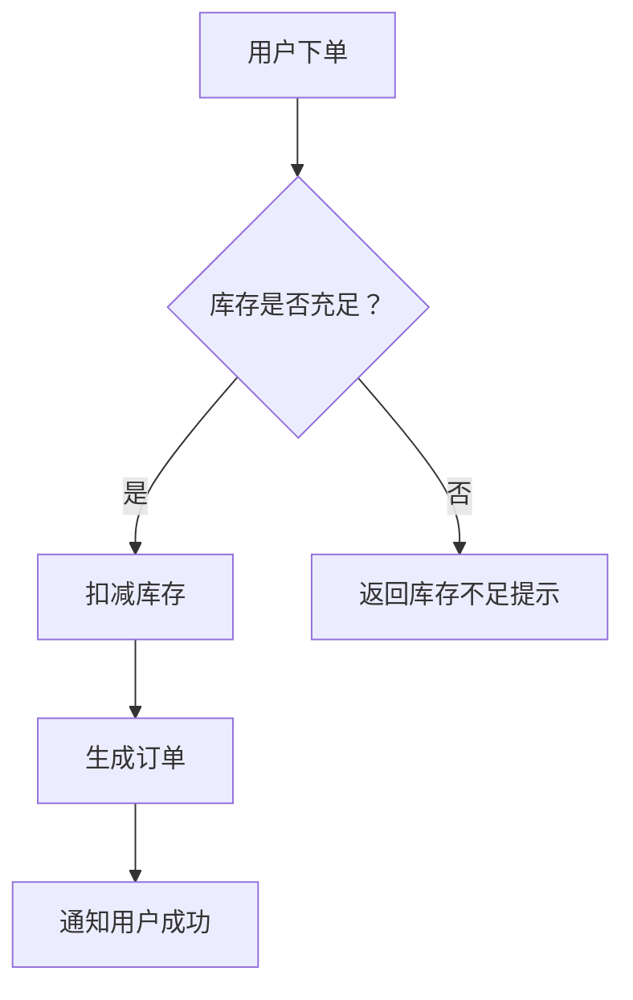
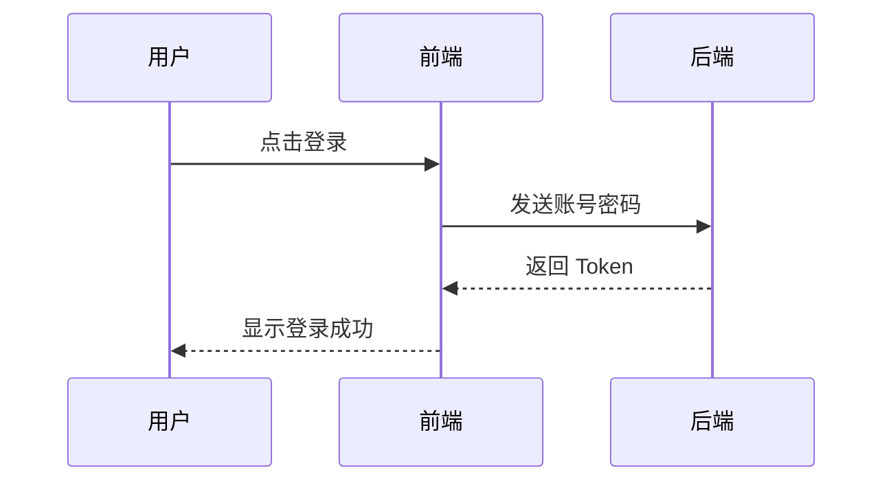
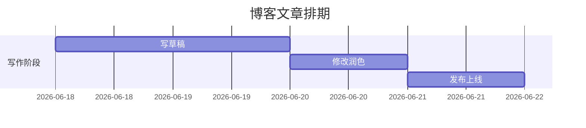
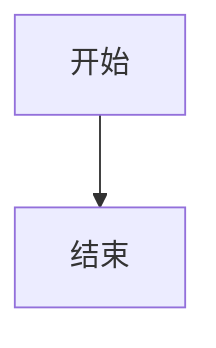

> 这是“博客搭建系列”的第九篇文章。前八篇我们完成了从搭建、排障、Markdown教程、导航配置到Git分支的完整链路。这一篇不讲博客本身，而是讲一个**写技术博客很有用的技能**——用 Mermaid 语言画流程图、时序图、甘特图。如果你觉得“画图很难”，这篇文章会改变你的看法。

---

## 什么是 Mermaid？

Mermaid 是一种**基于文本的图表绘制工具**。你不需要用鼠标拖拽画框，只需要写几行类似代码的文本，它就会自动生成图表。

**核心逻辑**：你写 `A --> B`，它自动画一个从 A 指向 B 的箭头。

你可以把它理解为“图表界的 Markdown”——就像你用 `#` 写标题、用 `**` 加粗一样，你用 `A --> B` 就能画流程图。

---

## 为什么你需要它？

如果你在博客里写技术教程、业务流程、项目排期，文字描述往往不够直观。比如：

> “用户提交订单后，系统先校验库存，如果库存充足则扣减库存并生成订单，如果库存不足则返回错误提示。”

这段文字用 Mermaid 画成流程图，读者一眼就能看懂。

**在技术博客里，一张图胜过千言万语。**

---

## 10 分钟上手：三种最常用的图

### 1. 流程图（最常用）

流程图用于展示“步骤 + 判断”的过程，比如业务审批、算法逻辑、操作流程。

**基础语法**：
- `graph TD`：从上到下画图
- `graph LR`：从左到右画图
- `A[文字]`：矩形节点
- `A{文字}`：菱形判断节点
- `A --> B`：从 A 指向 B 的箭头
- `A -- 标签 --> B`：带文字标签的箭头

**示例代码**：



### 2. 时序图（展示交互顺序）

时序图用于展示“谁先跟谁说话”，比如系统之间的接口调用、登录流程。

**基础语法**：
- `sequenceDiagram`：声明这是一个时序图
- `participant 名称`：定义参与交互的角色
- `A ->> B`：A 向 B 发送实线箭头请求
- `A -->> B`：A 向 B 发送虚线箭头响应

**示例代码**：



### 3. 甘特图（展示项目排期）

甘特图用于展示“任务在时间轴上的安排”，比如项目开发排期、活动筹备计划。

**基础语法**：
- `gantt`：声明这是一个甘特图
- `dateFormat YYYY-MM-DD`：日期格式
- `title`：图表标题
- `section 阶段名称`：任务分组
- `任务名 : 标识, 开始日期, 持续天数`

**示例代码**：



---

## 其他常用图表类型

| 图表类型 | 语法关键词 | 适用场景 |
| :--- | :--- | :--- |
| 状态图 | `stateDiagram-v2` | 订单状态流转（待支付 → 已支付 → 已发货） |
| 类图 | `classDiagram` | 编程中的类结构设计 |
| ER 图 | `erDiagram` | 数据库表关系设计 |
| 饼图 | `pie` | 数据占比展示 |

你不需要一次性学完所有类型。需要用哪种图，就去搜对应的示例代码，复制过来改文字即可。

---

## 在博客中如何使用？

你的博客（GitHub Pages）**原生支持 Mermaid**。你只需要在文章里用代码块包裹 Mermaid 语法即可。

**代码块写法**：

````markdown

````

提交推送后，这段代码就会自动渲染成一张图表。

**如果图表没有显示**：
1. 检查语言标签是否写成了 ` ```mermaid `（不是 ` ```merid ` 或 ` ```flow `）
2. 检查代码是否有语法错误（可以在 [Mermaid 官方在线编辑器](https://mermaid.live/) 里测试）

---

## 如何学习更多？

你不需要背语法。遇到需要画图时：

1. **打开在线编辑器**：`https://mermaid.live/`
2. **找到对应类型的示例代码**（官网有完整示例）
3. **修改文字**，改成你自己的内容
4. **复制代码**，粘贴到博客文章里

写 3-5 次之后，常用的语法就会自然记住。

---

## 总结

**Mermaid 的核心价值**：让你用写文本的方式画图，不需要学习复杂的设计软件，也不需要鼠标拖拽调整对齐。

**你只需要记住三点**：
- `graph TD` 画流程图
- `sequenceDiagram` 画时序图
- `gantt` 画甘特图

其他图表类型，用到了再查。

从现在开始，你的博客文章可以配上清晰的流程图和时序图了——这会让你的技术笔记看起来更专业、更容易理解。🎉
