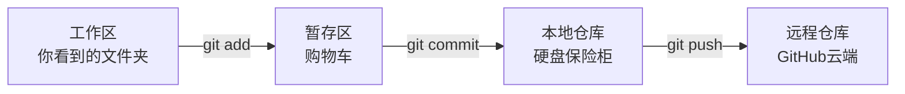
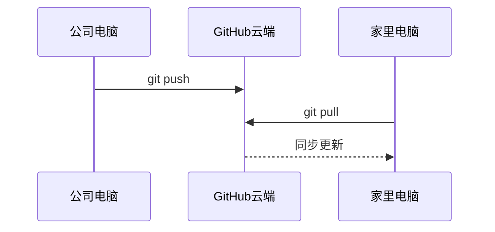

---

## 一、Git 到底在干嘛

Git 不是“上传文件”，而是经过 **4 层流转**：




| 区域 | 类比 | 说明 |
|------|------|------|
| 工作区 | 桌面 | 你直接看到的文件，随便改 |
| 暂存区 | 购物车 | 告诉 Git “这些东西我要管” |
| 本地仓库 | 保险柜 | commit 后的版本存这里，关电脑不丢 |
| 远程仓库 | 银行金库 | GitHub 云端备份，多设备靠它同步 |

**核心理解**：你的改动要经过“选 → 存 → 推”三步才能到云端，缺一不可。

---

## 二、日常命令速查

### 2.1 核心三连

```bash
# 1. 把改动放进购物车
git add .

# 2. 封存一个版本
git commit -m "今天干了什么"

# 3. 推到云端
git push
```

**记住：** 这顺序不能乱。

### 2.2 开始和同步

```bash
# 第一次下载整个仓库
git clone https://github.com/用户名/仓库名.git

# 每天第一件事：拉取远程最新代码
git pull

# 查看当前状态（红=未跟踪，绿=已暂存）
git status

# 查看提交历史（简洁版）
git log --oneline
```

### 2.3 我的每日操作模板

```bash
# 每天开始工作前
git pull

# 每天结束工作前
git add .
git commit -m "日期 做了什么"
git push
```

---

## 三、每个命令到底同步了什么

### git add —— 你选什么，它管什么

| 你的操作 | 是否被 git add 跟踪 |
|----------|--------------------|
| 新建文件 | 不自动，必须 git add |
| 修改文件 | 不自动，必须 git add |
| 删除文件 | 不自动，必须 git add |

**关键点**：`git add .` 是“把工作区此刻所有变动（新增+修改+删除）都加进去”。你不 add 的改动，Git 完全无视。

### git commit —— 暂存区有什么，就提交什么

只提交你 add 过的改动。没 add 的改动再大也不管。

### git push —— 已 commit 的全部推送

本地保险柜里有什么版本，就全部推到云端。**不能挑**。

### git pull —— 云端新增和修改会自动下载

| 操作 | 是否自动同步 |
|------|------------|
| 新增文件 | ✅ 自动下载到本地 |
| 修改文件 | ✅ 自动覆盖本地 |
| 删除文件 | ❌ **不会删除你本地的文件** |

> 这就是你之前遇到的困惑：GitHub 上删了文件，`git pull` 后本地文件不会消失。Git 认为“你本地有的文件，我不帮你擅自删”。

---

## 四、文件删除操作详解

### 场景 A：本地删了，想同步到 GitHub

```bash
# 方案 1：直接删文件后告诉 Git
rm 文件名
git add 文件名     # 或者 git rm 文件名（一步到位）
git commit -m "删了什么"
git push

# 方案 2：一步到位（推荐）
git rm 文件名
git commit -m "删了什么"
git push
```

### 场景 B：GitHub 上删了，想同步到本地

```bash
# 普通 git pull 不会自动删除本地文件
git pull

# 需要用这个
git pull --prune  # 清理本地已不存在的远程文件
```

### 场景 C：误删了文件，想恢复

```bash
# 还没 commit 的删除——直接恢复
git restore 文件名

# 已经 commit 了——从历史版本找回
git checkout HEAD~1 -- 文件名
```

---

## 五、多设备同步工作流



### 每天标准流程

```
上班 → git pull → 干活 → git add . → git commit → git push → 下班
家里 → git pull → 干活 → git add . → git commit → git push → 收工
```

### 冲突怎么办

如果家里和公司都改了同一个文件的同一行：

```bash
git pull
# 报错：CONFLICT
```

打开冲突文件，你会看到：

```
<<<<<<< HEAD
（你当前电脑的版本）
=======
（云端拉下来的版本）
>>>>>>> origin/main
```

**解决：** 删掉 `<<<<<<<`、`=======`、`>>>>>>>` 这三行标记，保留正确内容，然后：

```bash
git add .
git commit -m "解决冲突"
git push
```

---

## 六、必须记住的 6 个命令

| 命令 | 一句话 |
|------|--------|
| `git pull` | 从 GitHub 下载最新代码（每天第一件事） |
| `git add .` | 把所有改动放进“购物车” |
| `git commit -m "..."` | 把购物车里的东西封存成一个版本 |
| `git push` | 把版本推到 GitHub 云端 |
| `git status` | 看看当前有啥改动 |
| `git log --oneline` | 看看历史版本 |

---

## 七、常见误区

| 误区 | 真相 |
|------|------|
| “Git 就是传文件” | ❌ 经过 4 层流转，不是直接上传 |
| “git pull 后云端删的文件会消失” | ❌ 不会，要手动 `git rm` 或 `git pull --prune` |
| “没 push 就换电脑也能干活” | ❌ 不 push 就同步不了，家里电脑没有你的改动 |
| “push 被拒是出问题了” | ✅ 正常，先 `git pull` 合并再推就好 |
| “仓库改名没影响” | ❌ 本地要 `git remote set-url origin 新地址` |

---

## 写在最后

这份笔记是我学习 Git 过程中的真实记录，从“完全不懂”到“日常够用”的完整路径。如果你也是 Git 小白，希望它能帮你少走一些弯路。

Git 本质上就是 **选 → 存 → 推** 三步循环，理解了这一点，剩下的只是熟练度的问题。😊

---

### ✅ 发布前检查清单

1. **把 `date: YYYY-MM-DD` 改成今天的日期**
2. **确认仓库地址示例和你的实际地址一致**（如果是你的博客，路径是 `MorningLigt/morningligt.github.io`）
3. **复制到 `_posts/` 文件夹，命名为 `YYYY-MM-DD-git-learning-notes.md`**
4. **提交推送，等待 2 分钟刷新查看效果**

---

这份笔记涵盖了你日常使用 Git 的所有核心场景，可以作为你自己的速查手册，也适合分享给其他 Git 小白。😊
---
